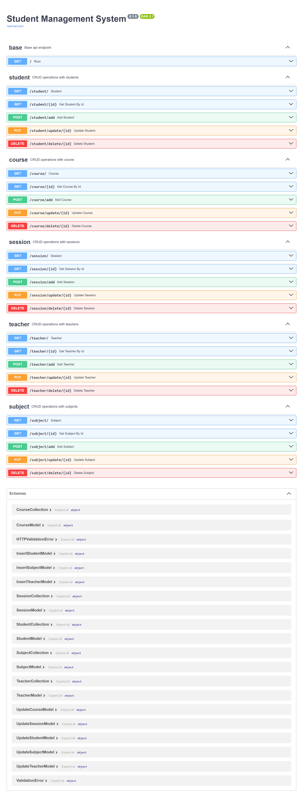

This is a [Next.js](https://nextjs.org/) project bootstrapped with [`create-next-app`](https://github.com/vercel/next.js/tree/canary/packages/create-next-app).

## Getting Started

First, run the development server:

```bash
npm run dev
# or
yarn dev
# or
pnpm dev
# or
bun dev
```

To run Backend api:   
_first install all requirements_   
- _Go to /api/ then run command:_ ```pip install -r requirements.txt```  
- _To run the api got to /api/ and then use command:_ ```fastapi dev main.py``` (**for development**) , ```fastapi run main.py``` (**for deployment**) , you can signify port number by running ```fastapi dev main.py --port <port_number>``` ( **default is 8000** )
> [!IMPORTANT]
> - You need mongod/mongodb to run the api.  
> - Install MongoDB from [here](https://www.mongodb.com/docs/manual/installation/).
> - Also Install MongoDB Compass from [here](https://www.mongodb.com/products/tools/compass).
> - Run MongoDB using command ```mongod``` or ```<path to mongod>\mongod.exe```
> - Run MongoDB Compass , use Mongosh to create a database StudentManagementDB: ```use StudentManagementDB```.
> - Run Command to create collection **student**,**course**,**subject**,**teacher** & **session** as: ```db.createCollection('<collection_name>')``` , **Note: collection name should be lowercase all**.
> - You can then run the api run command.


Open [http://localhost:3000](http://localhost:3000) with your browser to see the result.
Open [http://localhost:8000](http://localhost:8000) wiht your browser to see the api endpoints.

You can start editing the page by modifying `app/page.tsx`. The page auto-updates as you edit the file.

This project uses [`next/font`](https://nextjs.org/docs/basic-features/font-optimization) to automatically optimize and load Inter, a custom Google Font.

## Learn More

To learn more about Next.js, take a look at the following resources:

- [Next.js Documentation](https://nextjs.org/docs) - learn about Next.js features and API.
- [Learn Next.js](https://nextjs.org/learn) - an interactive Next.js tutorial.

You can check out [the Next.js GitHub repository](https://github.com/vercel/next.js/) - your feedback and contributions are welcome!

## Deploy on Vercel

The easiest way to deploy your Next.js app is to use the [Vercel Platform](https://vercel.com/new?utm_medium=default-template&filter=next.js&utm_source=create-next-app&utm_campaign=create-next-app-readme) from the creators of Next.js.

Check out our [Next.js deployment documentation](https://nextjs.org/docs/deployment) for more details.

## API Endpoints
These are the API endpoints for Student management system

Made using [FastAPI](https://fastapi.tiangolo.com/)


